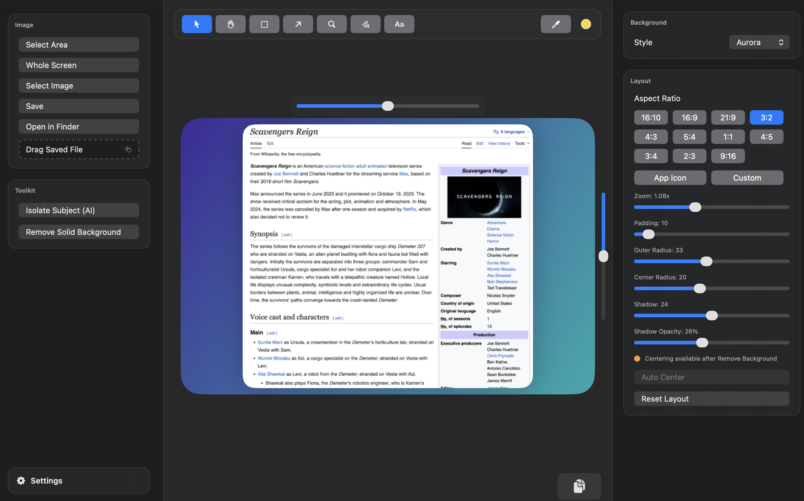

# OpenSnapper

OpenSnapper is an open-source macOS screenshot tool for clean captures, quick styling, and fast sharing.

<p align="center">
  
</p>

[](#requirements)
[](#requirements)
[](./LICENSE)

## App Preview

<p align="center">
  
</p>

## Why OpenSnapper

OpenSnapper focuses on a practical workflow:

1. Capture quickly.
2. Apply layout/background styling.
3. Save or copy instantly.

It is designed to stay lightweight, local-first, and scriptable for contributors.

## Highlights

- Select-area capture
- Whole-screen capture
- Screen color picker with live hover preview
- Recent picked colors in menu bar
- Drag-and-drop image import
- Clipboard paste and copy
- Background styles and solid color background
- Layout controls (aspect ratio, zoom, padding, radius, shadow)
- Menu bar quick actions for screenshot and color picker

## Requirements

- macOS 13 or later
- Swift 6.2 toolchain (or Xcode with compatible SwiftPM)

## Quick Start

```bash
git clone <your-fork-or-repo-url>
cd opensnapper
swift run OpenSnapper
```

## Build and Run App Bundle

Running as an app bundle is recommended for Screen Recording permission flows.

```bash
./scripts/build-app.sh
./scripts/run-app.sh
```

## Script Reference

`./scripts/build-app.sh`
- Builds the executable
- Creates `dist/OpenSnapper.app`
- Generates `AppIcon.icns`
- Codesigns the app bundle

`./scripts/run-app.sh`
- Launches `dist/OpenSnapper.app`
- Leaves Screen Recording permission unchanged by default

Optional (local debugging only):

```bash
./scripts/run-app.sh --reset-screen-capture
```

or:

```bash
RESET_SCREEN_CAPTURE=1 ./scripts/run-app.sh
```

## Configuration

Default bundle identifier:

`com.opensnapper.app`

Override it for local variants:

```bash
BUNDLE_ID=com.yourname.opensnapper ./scripts/build-app.sh
```

## Project Structure

`Sources/OpenSnapper`
- SwiftUI app code and editor state

`Resources`
- App icons and static assets

`scripts`
- Build/run/dev helper scripts

`dist`
- Generated app bundle output (ignored in git)

## Contributing

See `CONTRIBUTING.md`.

## License

MIT License. See `LICENSE`.
